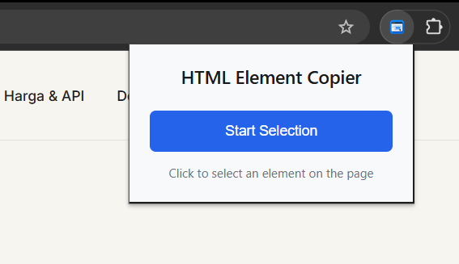
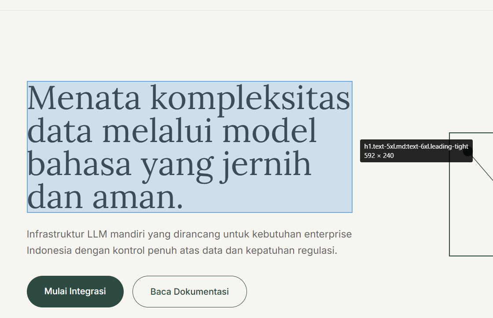

<div align="center">
  
  
  # HTML Element Copier

  **Copy HTML of any webpage element with a single click**

  [](manifest.json)
  [](LICENSE)
  [](https://developer.chrome.com/docs/extensions/mv3/)
  [](https://developer.mozilla.org/en-US/docs/Web/JavaScript)

  A Chrome extension that lets you copy the HTML of any element on a webpage with a single click, similar to DevTools' Inspect Element feature.

</div>

---

## Demo

<table>
<tr>
<td width="50%">
  
  <p align="center"><em>Extension popup with "Start Selection" button</em></p>
</td>
<td width="50%">
  
  <p align="center"><em>Selection mode with element highlighting and tooltip</em></p>
</td>
</tr>
</table>

## Features

- **Visual Selection Mode** - DevTools-like element highlighting with blue overlay
- **Element Information** - Hover tooltip showing CSS selector and dimensions
- **Click Interception** - Prevents element interaction during selection
- **Instant Clipboard Copy** - HTML copied automatically on click
- **Keyboard Shortcuts** - Press ESC to cancel selection
- **Toast Notifications** - Visual feedback when HTML is copied

## Prerequisites

- Chrome or any Chromium-based browser (Edge, Brave, Opera, etc.)
- No build tools or dependencies required

## Installation

### Load as Unpacked Extension

1. Clone or download this repository:
   ```bash
   git clone <repository-url>
   cd html-element-copier
   ```

2. Open Chrome and navigate to `chrome://extensions/`

3. Enable **Developer mode** (toggle in the top right)

4. Click **Load unpacked** and select the `html-element-copier` folder

5. (Optional) Pin the extension by clicking the puzzle icon in the toolbar

## Usage

1. Click the extension icon in your browser toolbar
2. Click **Start Selection** in the popup
3. Move your mouse over the page - elements will highlight as you hover
4. Click any element to copy its HTML to clipboard
5. A toast notification confirms the copy

**Keyboard shortcuts:**
- **ESC** - Exit selection mode

## How It Works

### Architecture

The extension uses Chrome Manifest V3 with three main components:

**Popup (`popup.html` + `popup.js`)**  
Simple UI with a "Start Selection" button that sends a message to the background script.

**Background Service Worker (`background.js`)**  
Routes messages between the popup and content script. Handles content script injection for pages where it's not already loaded.

**Content Script (`content.js`)**  
Contains the selection logic:
- Creates overlay and tooltip elements
- Listens for mouse movement to update highlights
- Intercepts clicks using capture phase to prevent website interactions
- Copies `element.outerHTML` to clipboard
- Shows toast notification and exits selection mode

### Event Flow

```
User clicks extension icon
  → Popup opens with "Start Selection" button
  → User clicks button
  → Background script receives message
  → Background script forwards to content script
  → Content script enters selection mode
  → User hovers over elements (highlighted with tooltip)
  → User clicks element
  → HTML copied to clipboard
  → Toast notification shown
  → Selection mode exits
```

### Click Interception

The extension uses event capture to prevent clicks from triggering website functionality:

```javascript
event.preventDefault();
event.stopPropagation();
event.stopImmediatePropagation();
```

This ensures clicks only select elements without:
- Following links
- Submitting forms
- Opening modals
- Playing videos
- Expanding dropdowns

## Project Structure

```
html-element-copier/
├── manifest.json          # Extension manifest (V3)
├── background.js          # Service worker
├── content.js             # Selection and copy logic
├── popup.html             # Extension popup UI
├── popup.js               # Popup interaction logic
├── popup.css              # Popup styling
├── overlay.css            # Overlay CSS custom properties
└── icons/                 # Extension icons (16, 32, 48, 128)
```

## Permissions

The extension requires minimal permissions:

- **activeTab** - Access the currently active tab only
- **scripting** - Inject content script into pages
- **clipboardWrite** - Copy HTML to clipboard

> [!NOTE]
> The extension cannot access `chrome://`, `chrome-extension://`, or `about:` pages due to browser security restrictions.

## Limitations

### Cross-Origin Iframes

The extension cannot access content inside iframes from different domains due to the Same-Origin Policy.

Examples:
- ❌ YouTube embeds
- ❌ Google Maps iframes
- ✅ Same-origin iframes

### Shadow DOM

- ✅ Open shadow DOM is accessible
- ❌ Closed shadow DOM cannot be accessed

### Dynamic Content

The extension copies the HTML snapshot at the moment of selection. JavaScript state, event listeners, and dynamic behavior are not included.

## Development

### Testing

1. Load the extension as unpacked (see Installation)
2. Open any website (e.g., https://example.com)
3. Activate selection mode and test the workflow
4. Check browser console for any errors

### Debugging

**Background Script:**
```
chrome://extensions/ → HTML Element Copier → Service Worker → inspect
```

**Content Script:**
```
Open any webpage → F12 → Console tab
```

**Popup:**
```
Right-click extension icon → Inspect popup
```

## Publishing

Before publishing to the Chrome Web Store:

1. Update `manifest.json` with proper version and metadata
2. Create high-quality icons to replace placeholders
3. Prepare store listing assets (screenshots, description, etc.)
4. Create a ZIP file:
   ```bash
   zip -r html-element-copier.zip * -x "*.git*"
   ```
5. Upload to [Chrome Web Store Developer Dashboard](https://chrome.google.com/webstore/devconsole)

## Future Ideas

Potential enhancements for future versions:

- Copy CSS selector or XPath instead of HTML
- Copy `innerHTML` or `textContent` options
- Copy computed styles
- Element screenshot capture
- Multi-select mode
- Keyboard shortcut for copying (Enter key)
- Dark mode support
- History of last 10 copied elements
- Continuous mode (stay in selection after copy)

## Known Issues

No known issues at this time.

To report a bug, please include:
- Browser version
- Extension version
- Website URL where the issue occurred
- Steps to reproduce
- Expected vs actual behavior

## Tips

- **Nested elements** - Click the innermost element for precise selection
- **Large HTML** - Copying large elements (like `<body>`) may take a moment
- **Formatting** - Paste into a code editor for automatic HTML formatting
- **Practice** - Try on different websites to get familiar with the selection behavior

## License

MIT License - Feel free to use and modify.

---

**Built with vanilla JavaScript and Chrome Manifest V3**
